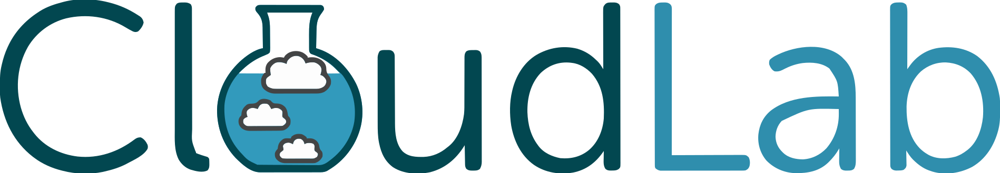

<h1>Hi, I'm Sean!  <a href="https://github.com/seanberlin724">Aspiring Cybersecurity Professional</a>, <a href="https://www.linkedin.com/in/sean-berlin/">Programmer</a></h1>

<h2>🔒 Cybersecurity Projects Highlights</h2>

- <b>IT Security and Management Labs </b>
  - [Hands-On Active Directory: Deployment and Security Monitoring](https://github.com/seanberlin724/Hands-On-Active-Directory-Deployment-and-Security-Monitoring-Lab)
  - [Personal SOC: Azure and Microsoft Sentinel](https://github.com/seanberlin724/Personal-Security-Operations-Center-SOC-with-Azure-and-Microsoft-Sentinel)
  

- <b>Malware Analysis </b>
  - [Analysis of Zeus: Trojan Malware](https://github.com/seanberlin724/Malware-Analysis/tree/main/Final%20Project%3A%20Malware%20Analysis%20of%20Zeus)

- <b>Exploit Programs </b>
  - [Return-Oriented Programming (ROP)](https://github.com/seanberlin724/Software-Security-Labs-Series/tree/main/Lab%203%3A%20Return-Oriented%20Programming%20(ROP)%20Exploitation)
  - [Multi-Stage Attack](https://github.com/seanberlin724/Software-Security-Labs-Series/tree/main/Lab%204%3A%20Multi-Stage%20Exploits)
  - [CTF Remote Server](https://github.com/seanberlin724/Software-Security-Labs-Series/tree/main/Final%20Project%3A%20CTF)
  

<h2>👨‍💻 Programming Projects Highlights</h2>

- <b>Java </b>
  - [Jagged Grid Reader (for grid-based games)](https://github.com/seanberlin724/Jagged-Grid-Reader.git)
  - [Recursion: Solving a Maze](https://github.com/seanberlin724/Recursion-Solving-a-Maze.git)
 
- <b>Python</b>
    - [Heuristic Malware Detection System](https://github.com/seanberlin724/Malware-Analysis/tree/main/Lab%203%3A%20Heuristic%20Malware%20Detection%20System)
    - [Dynamic Heuristic Analysis Tool for Ransomware Detection](https://github.com/seanberlin724/Malware-Analysis/tree/main/Lab%205%3A%20Dynamic%20Heuristic%20Analysis%20Tool%20Development%20for%20Ransomware%20Detection)
 
- <b>C#</b>
    - [Towers of Hanoi: Interactive Game ](https://github.com/seanberlin724/C-Sharp-Projects/blob/main/Towers%20of%20Hanoi/README.md)
 
- <b>Bash</b>
    - [Shell Script Roster Program ](https://github.com/seanberlin724/Bash-Scripting/tree/main/Student%20Roster)

### Languages:
| Java | Python | C# | SQL | OCaml | Bash |
|------|--------|----|-----|-------|------|
|   |   |  |  |  |  | 

### Environments, Testing, Other:
| Git | CloudLab | Docker | Kubernetes | Jenkins | VirtualBox | GitHub |
|-----|----------|--------|------------|---------|------------|--------|
||||  &nbsp;&nbsp;&nbsp;|  |&nbsp;&nbsp;&nbsp;| |

### OS:
| Windows | Linux | Ubuntu | Kali |
|---------|-------|--------|------|
|&nbsp;&nbsp; | |  |  |

### Tools for Penetration Testing & CTFs
| Metasploit | Wireshark | Burpsuite | Netcat | Nmap |
|----------|----------|----------|----------|----------|
||||||

## Certifications

## SIEM

<h2> 🤳 Connect with me:</h2>

[][linkedin]&nbsp;&nbsp;&nbsp;&nbsp;&nbsp;&nbsp;&nbsp;&nbsp;&nbsp;&nbsp;&nbsp;&nbsp;&nbsp;&nbsp;
[][twitter]&nbsp;&nbsp;&nbsp;&nbsp;&nbsp;&nbsp;&nbsp;&nbsp;&nbsp;&nbsp;&nbsp;&nbsp;&nbsp;&nbsp;&nbsp;&nbsp;&nbsp;
[][instagram]&nbsp;&nbsp;&nbsp;&nbsp;&nbsp;&nbsp;&nbsp;&nbsp;&nbsp;&nbsp;&nbsp;&nbsp;&nbsp;&nbsp;&nbsp;&nbsp;&nbsp;
[🛡️][website]
  
[LinkedIn][linkedin] &nbsp;&nbsp;&nbsp;&nbsp;&nbsp;&nbsp;&nbsp;
[Twitter][twitter] &nbsp;&nbsp;&nbsp;&nbsp;&nbsp;&nbsp;&nbsp;
[Instagram][instagram] &nbsp;&nbsp;&nbsp;&nbsp;&nbsp;&nbsp;&nbsp;
[Website][website]<b><i>(Coming Soon)</b></i>

[linkedin]: https://www.linkedin.com/in/sean-berlin/
[twitter]: https://twitter.com/SeanBerlin_
[instagram]: https://www.instagram.com/sean_berlin/
[website]: https://www.google.com

<!--
**seanberlin724/seanberlin724** is a ✨ _special_ ✨ repository because its `README.md` (this file) appears on your GitHub profile.

Here are some ideas to get you started:

- 🔭 I’m currently working on ...
- 🌱 I’m currently learning ...
- 👯 I’m looking to collaborate on ...
- 🤔 I’m looking for help with ...
- 💬 Ask me about ...
- 📫 How to reach me: ...
- 😄 Pronouns: ...
- ⚡ Fun fact: ...
-->
